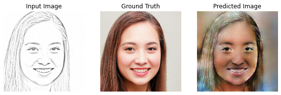
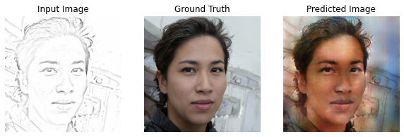
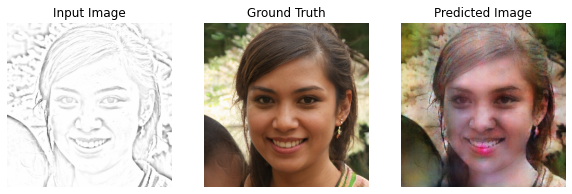

# Reconstrucción de Rostros basado en redes Cgan (Pix2Pix)
___

El siguiente repositorio contiene el proyeccto de reconstrucción de rostros utilizando la arquitectura Pix2Pix. Para la construcción base del modelo se han tomado dos referencias:

- El [tutorial](https://www.tensorflow.org/tutorials/generative/pix2pix)  oficial de la pagina de tensorflow.
- El [tutorial](https://www.youtube.com/watch?v=YsrMGcgfETY) de DotCSV acerca de pix2pix.

El proyecto fue hecho para el curso de **Python para Data Science** del Diplomado de Inteligencia Artificial de la Pontificia Universidad Católica del Perú.

___
## Dependencias:
Se está utilizando como framework principal Tensorflow 2.2.0, usando parte del API Keras para la arquitectura del modelo y el API nativo tensorflow para el entrenamiento.
- Tensorflow (2.2.0)
- Matplotlib (3.2.1)
- Numpy (1.18.4)
___

## Proceso

### Objetivo
El proyecto se enfoca en la reconstrucción de rostros de personas teniendo como base una imágen tipo trazado de lápiz. Una posible aplicación importante sería el apoyo a la contrucción de retratos hablados (Police Sketches) en criminalística.

### Dataset
Se extrajeron datos de la página [This Person Doesn't Exist](https://thispersondoesnotexist.com/) para evitar problemas de datos personales. Reunimos 754 imágenes para la prueba.
Al ser una red GAN, se requiere de una imágen tanto como para el dataset de entrada como para el label. Con las imágenes arriba completamos los labels, y para las imágenes de entrada se hicieron las siguientes modificaciones a los targets:
- Efecto fotocopia:
    - Detalle: 15
    - Darkness: 3
- Posterize:  
    - Nivel 10

Lo ideal sería completar este dataset con imágenes hechas por efectivos policiales dedicados a la materia, pero debido al contexto del desarrollo este procedimiento nos pareció el más acertado para el trabajo.

### Arquitectura y parámetros
La arquitectura utilizada fue Pix2Pix (véase [Paper Oficial](https://arxiv.org/pdf/1611.07004.pdf)). Se utilizaron  los downsamples y upsamples establecidos en el documento. Al ser una red GAN, tenemos dos modelos, el *Generador* y el *Discriminador*. Las arquitecturas de ambos son así:
#### Generador

#### Discriminador

Se utilizaron capas interesantes utilizadas son las Convolucionales Inversas y Batch Normalization.

Siguiendo el paper oficial, se utilzaró Binary Crossentropy como función de pérdida tanto para el discriminador como para el generador. Como optimizador, se hicieron pruebas con Adam y Rectified Adam, probando distintos learning rates desde el rango de 1e-3 hasta 1e.6.

### Entrenamiento
Se dividió la data total en entrenamiento/validación con una proporción de 0.8/0.2.
Se empezó el entrenamiento con Rectified Adam a 2e-4, disminuyendo este parámetro en un factor de 0.1 cada 50 épocas. Se observó overfiting en el proceso, por eso se recurrió al optimizador Adam desde 1e-3 hasta 1e-6 bajo el mismo factor.

*Un detalle a tener en cuenta para las redes GAN es que la función de pérdida no nos da una información clara del desempeño de nuestra red, por lo que tenemos que comparar constantemente las imagenes generadas en cada época*:
##### Primera Época:

### Resultados
La red generadora, si bien acierta en el color de algunos detalles de los rostros (cabello ozcuro, cambio de detalle en pómulos, labios rojos), la generación de imágen no es la esperada. Uno de los factores más importantes que podemos identificar es la poca cantidad de datos existentes en nuestro dataset. Si bien 754 imágenes podrían parecer una gran cantidad, lo cierto es que las redes GAN requieren una mucho mayor cantidad de datos para aprender a generalizar de manera óptima alguna tarea.
A continuación algunos resultados:

